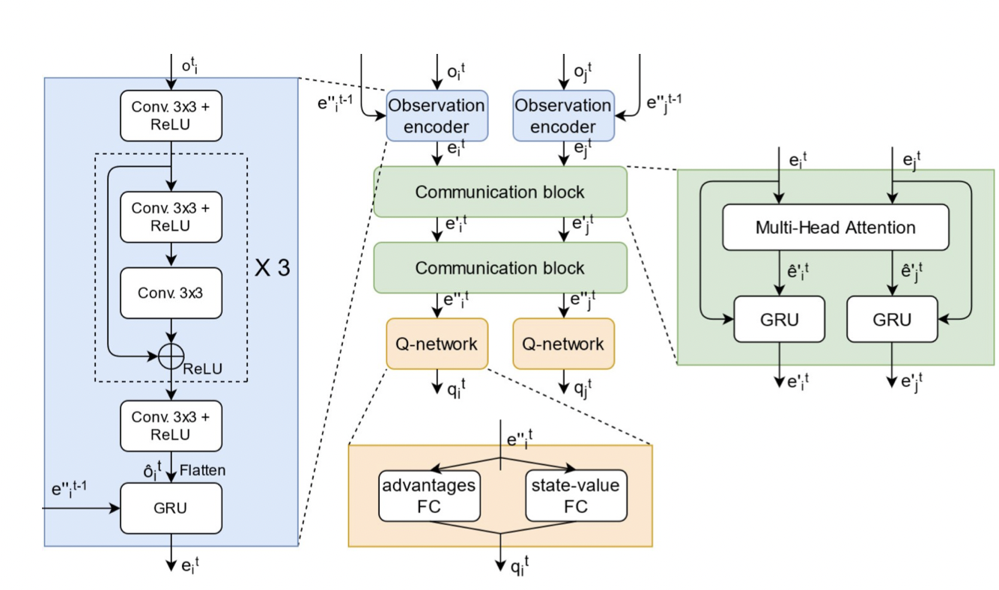
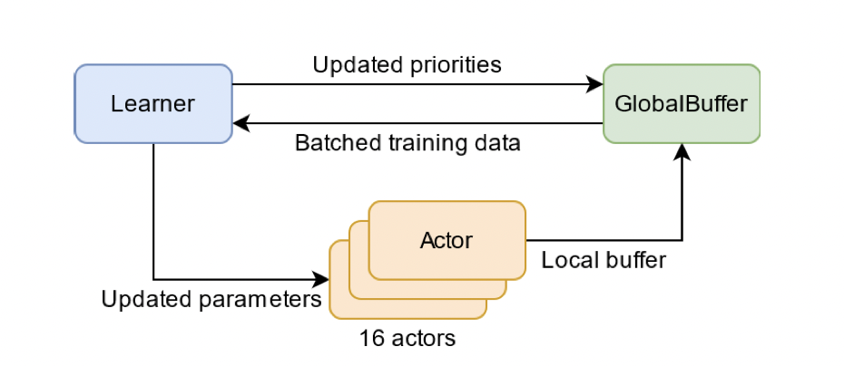
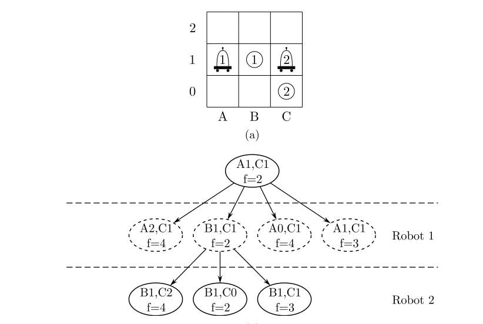
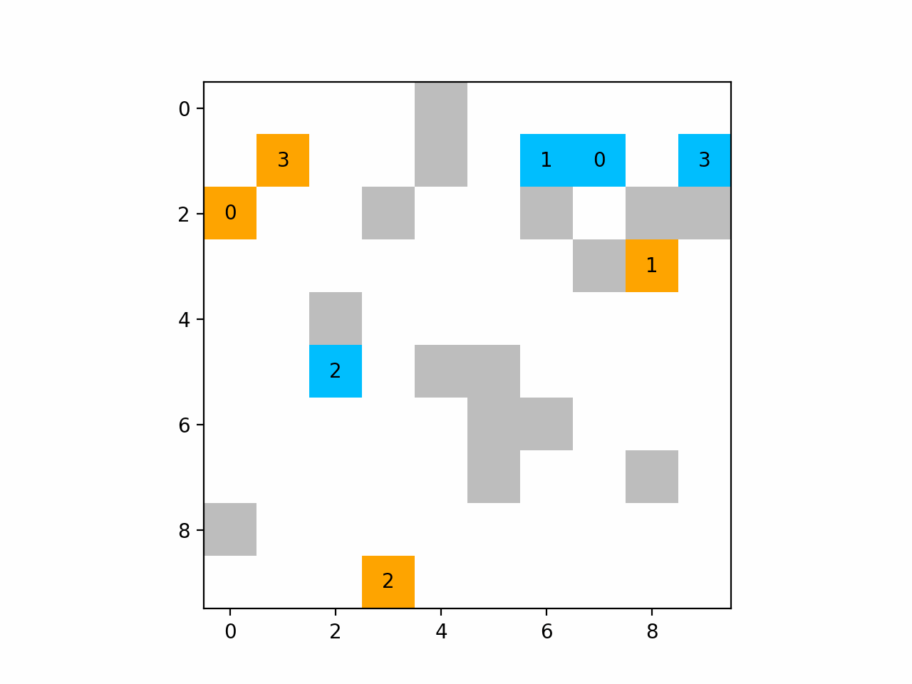
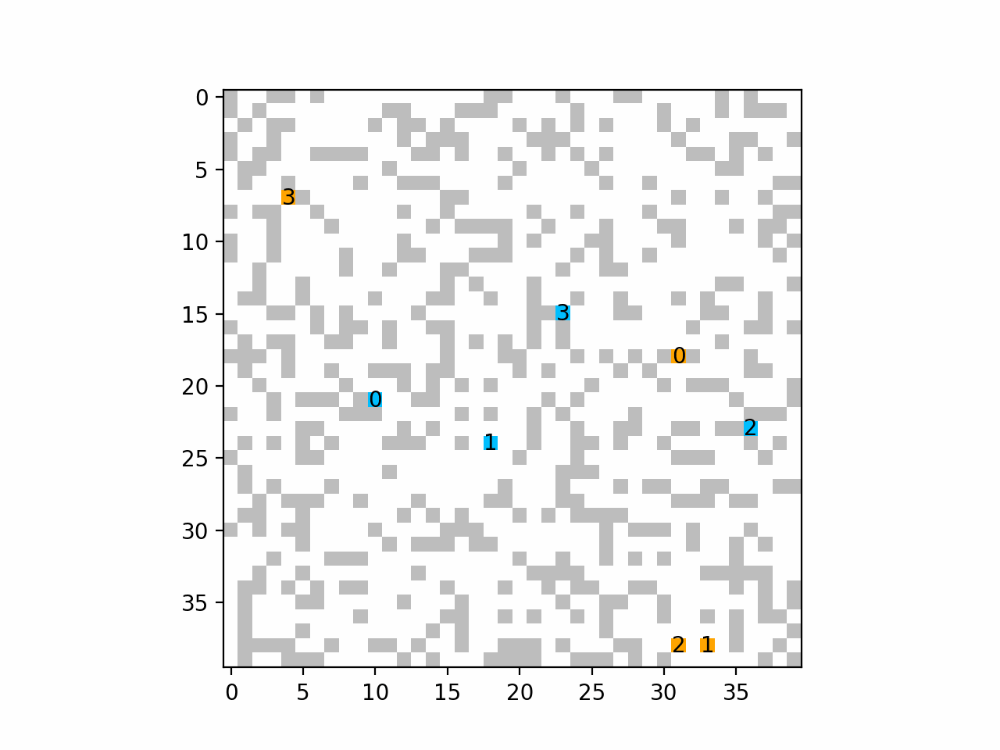
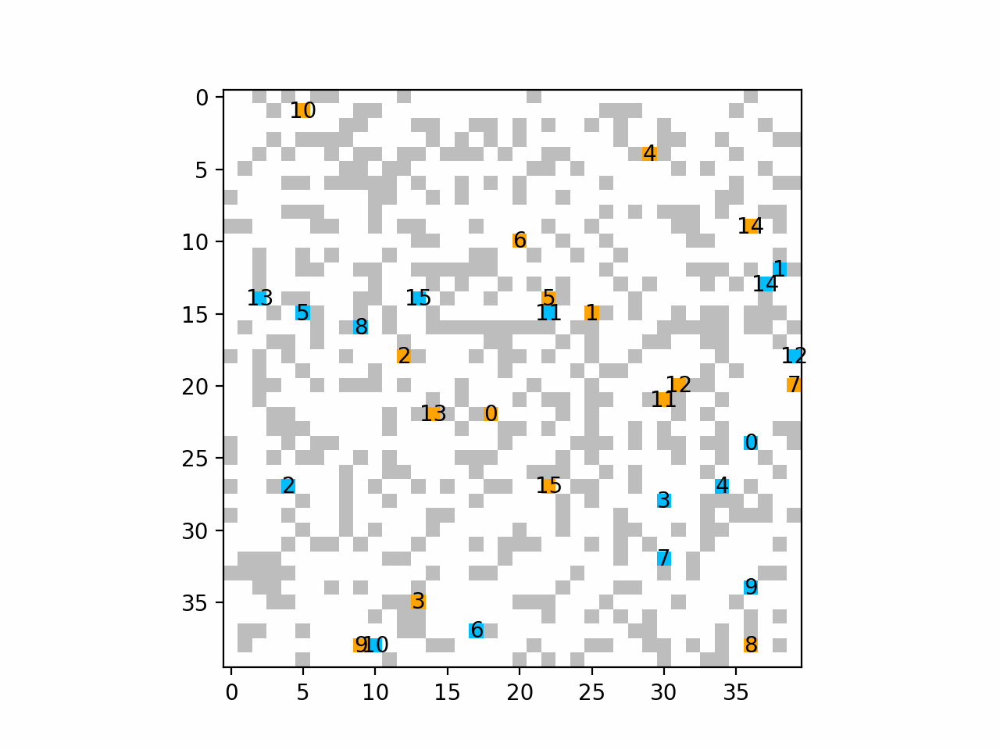

# Multi-agent Path Finding using Reinforcement Learning


## Description

**Multi-agent pathfinding in partially observable environments. Search-based vs. RL-based algorithms.**

The main goal of this repository is to provide a DHC [1] model implementation alongside with some benchmarks and charts. 
We also aim to compare the performance of the DHC model with the basic M* algorithm.

## Requirements
In order for `models.dhc.train` to be successfully run, you have to have a machine equipped with 1 GPU and several CPUs.
Consider having `num_cpus - 2` actors configured through the `dhc.train.num_actors` in `config.yaml`

**Attention: We do not guarantee the desired performance on a non-GPU machine.**

While we aim at supporting MacOS, Linux and Windows platforms, the successful training is not guaranteed on a Windows-based machine. 
The benchmarking script should work there, though. Please report it [here](https://github.com/acforvs/multi-agent-pathfinding/issues) if it doesn't.

## Setting up
1. Install [Poetry](https://python-poetry.org)
2. Run [poetry install](https://python-poetry.org/docs/cli/#install) to install the dependencies

If you see ``Failed to create the collection: Prompt dismissed..`` this error when trying to run `poetry install`, [consider](https://github.com/python-poetry/poetry/issues/1917#issuecomment-1251667047) executing this line first:
```shell
export PYTHON_KEYRING_BACKEND=keyring.backends.null.Keyring
```

## Repository description & Usage 
1. `models` dir contains the weights of the trained models
2. `config.yaml` - training & model params, environmental settings etc.
3. `pathfinding/models` provides one with the implementation of different models

## Models
### DHC

**D**istributed, **H**euristic and **C**ommunication [1]

> To guide RL algorithm on long-horizon goal-oriented tasks, we embed the potential choices of shortest paths from single source as heuristic guidance instead of using a specific path as in most existing works. Our method treats each agent independently and trains the model from a single agent’s perspective. The final trained policy is applied to each agent for decentralized execution. The whole system is distributed during training and is trained under a curriculum learning strategy.

  
 

### M*

**Multi-dimensional A***

  

---
**Details:**

<details>
    <summary>Generate test cases</summary>

**To generate test cases, run** 
```shell
poetry run python3 pathfinding/utils.py generate_test_suits TESTS_DESCR REPEAT_FOR
```
where
* TESTS_DESCR is a string of the format `'[(map_length, num_agents, density), ...]'`
* REPEAT_FOR is the amount of test cases of each configuration

For example, by running
```shell
poetry run python3 pathfinding/utils.py generate_test_suits '[(40, 16, 0.3), (80, 4, 0.1)]' 10
```
you will create 20 test cases in total:
* 10 cases with a 40x40 map with a density of 30% + 16 agents in it
* 10 cases with a 80x80 map with a density of 10% + 4 agents in it

</details>


<details>
    <summary>DHC</summary>

#### Benchmarking 

**To run the generated test suite, run**
```shell
poetry run python3 pathfinding/models/dhc/evaluate.py test_model TESTS_DESCR MODEL_ID
```
where
* TESTS_DESCR is a string of the format `'[(map_length, num_agents, density), ...]'` (you may want to copy this line from the generation command)
* MODEL_ID is the name of the file from the `models` dir
For example, by running

```shell
poetry run python3 pathfinding/models/dhc/evaluate.py test_model '[(40, 16, 0.3), (80, 4, 0.1)]' 60000
```
you will benchmark the `models/60000.pth` on the provided test cases 

**Attention: the test cases must be generated first!** 

#### Training
1. Set the desired `actors` amount by setting the appropriate value for `dhc.train.num_actors` in `config.yaml`

It is recommended to use the amount of CPU cores on you machine minus 2

2. To initialize training, run
```shell
poetry run python3 pathfinding/models/dhc/train.py
```

The `models` dir will be created afterwards where the weights of the intermediate models will be saved.

</details>


<details>
    <summary>M*</summary>

#### Benchmarking 

**To run the generated test suite, run**
```shell
poetry run python3 pathfinding/models/mstar/evaluate.py test_model TESTS_DESCR
```
where
* TESTS_DESCR is a string of the format `'[(map_length, num_agents, density), ...]'` (you may want to copy this line from the generation command)
For example, by running

```shell
poetry run python3 pathfinding/models/mstar/evaluate.py test_model '[(10, 4, 0.1), (20, 4, 0.1)]'
```
you will benchmark the Multi-dimensional A* algorithm on the provided test cases 

**Attention: the test cases must be generated first!** 

**While we aim at supporting different platforms, the current implementation requires the call to be successful on your platform.** 

**Please ensure this is the case before running any benchmark for M***
```shell
g++ -O2 -std=c++17 -o 'pathfinding/models/mstar/main' 'pathfinding/models/mstar/main.cpp'
```

</details>

## Our setup
The DHC network was trained on a single [NVIDIA TESLA T4 GPU](https://www.nvidia.com/en-us/data-center/tesla-t4/) for 7 hours.

We used 20 CPU cores, 18 were used for the actors, additionally, 2 cores were used for the Learner and GlobalBuffer all together.


## DHC Results






## Contributing
<details>
    <summary>See the detailed contribution guide</summary>

1. Install [black](https://github.com/psf/black), you can likely run
```shell
pip3 install black 
```

3. Use [black](https://github.com/psf/black) to ensure that the codestyle remains great
```shell
poetry run black dir
```
2. Make sure tests are OK 
```shell
poetry run pytest
```
3. Create a PR with new features
</details>

## References

<a id="1">[1]</a> 
Ma, Ziyuan and Luo, Yudong and Ma, Hang, 2021. Distributed Heuristic Multi-Agent Path Finding with Communication.

<a id="2">[2]</a> 
Sartoretti, G., Kerr, J., Shi, Y., Wagner, G., Kumar, T.S., Koenig, S. and Choset, H., 2019. Primal: Pathfinding via reinforcement and imitation multi-agent learning. IEEE Robotics and Automation Letters, 4(3), pp.2378-2385.

## License

[](https://github.com/acforvs/multi-agent-pathfinding/blob/main/LICENSE)


